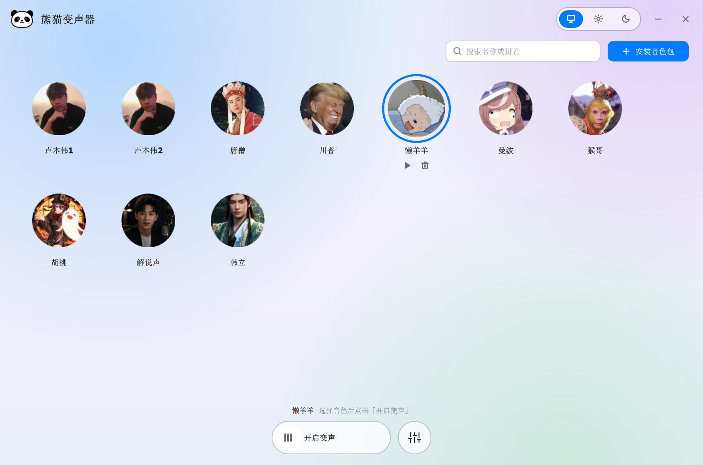
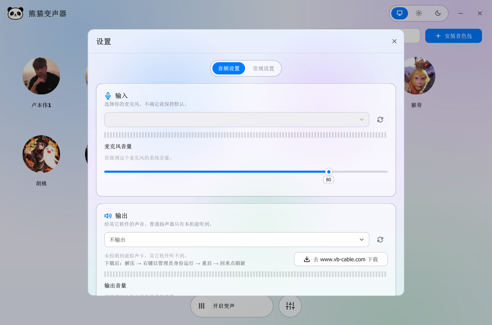
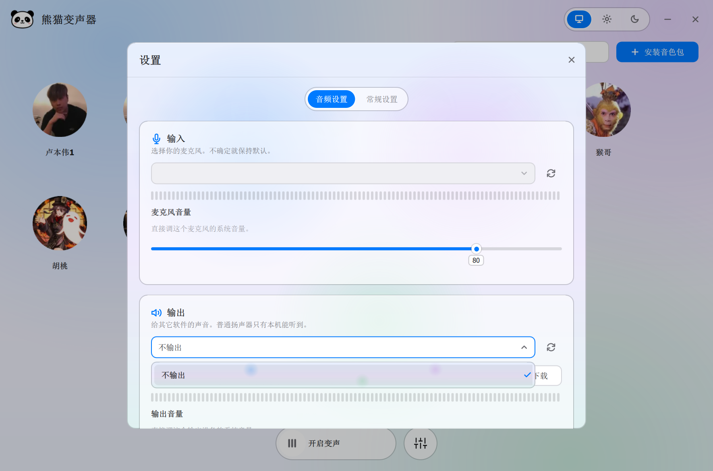
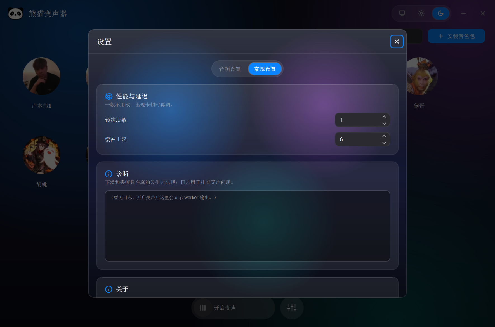

# 熊猫变声器 (Panda Voice Changer)

把麦克风里的声音实时换成目标音色的变声软件，处理全在本机完成，不联网、
不注册账号，音频不会传到任何地方。支持 Windows 10/11 x64。

- 纯 CPU 就能实时跑，不用显卡；实测 RTF 0.32–0.76，连续 30 分钟没有卡顿
- 界面三种主题：浅色、深色、跟随系统
- 音色包是带校验的 zip，界面里可以单个装，也可以多选批量装
- 内置实时降噪（三档）、噪声门，支持耳机监听
- 绿色版，解压就能用

## 下载与使用

从 [Releases](../../releases) 下载四个资产：

| 资产 | 内容 | 大小 |
| --- | --- | --- |
| `Panda-1.0.0.zip` | 主程序（exe、Qt 运行库、引擎、启动脚本） | ~40 MB |
| `Panda-runtime.zip` | Python 运行时 + 降噪模型 | ~0.6 GB |
| `Panda-Models.zip` | 变声模型 | ~1.7 GB |
| `Panda-Pack.zip` | 音色包导出工具（可选，不带环境） | 几 MB |

三个应用包解压到**同一个空文件夹**，双击 `launch.cmd` 启动。
不用做任何设置，放哪个盘都能跑。

### 让游戏 / 直播软件听到你

Discord、游戏、OBS 只认"麦克风"，需要装一块虚拟声卡中转（一次性）：

1. 下载安装 [VB-CABLE](https://www.vb-cable.com/)（解压 → 右键管理员运行 → 重启）
2. 熊猫变声器的「输出」选 `CABLE Input`（带虚拟声卡标记）
3. 对方软件的「麦克风」选 `CABLE Output`

自己想听效果，「监听输出」选耳机就行。

## 音色包

- 「安装音色包」支持单个安装和多选批量安装，有进度显示，失败会提示原因。
- 音色只保存在本机 `voices\` 文件夹，不上传、不同步，升级覆盖安装也不会丢失。
- 自己做音色包：下载 `Panda-Pack.zip`，解压后按里面的 `README.txt` 操作，
  用一段干净人声就能导出（支持 WAV/MP3/FLAC/OGG 等格式）。

## 文档

| 文档 | 内容 |
| --- | --- |
| [CHANGELOG](CHANGELOG.md) | 版本更新日志 |
| [docs/DEVELOPMENT.md](docs/DEVELOPMENT.md) | 开发：环境搭建、架构、测试、打包与发布全流程 |

源码构建、贡献流程、音色包格式规范、训练指南都在 DEVELOPMENT 里。

## 许可

Apache License 2.0，见 [LICENSE](LICENSE)；Apache 声明见 [NOTICE](NOTICE)。
捆绑的开源组件如下（许可证原文随包分发于 `third_party/notices/`）：

| 组件 | 说明 | 许可证 |
| --- | --- | --- |
| [Qt](https://www.qt.io/) 6.8.3 | 桌面运行时，随包分发 | LGPL-3.0 |
| [Python](https://www.python.org/) 3.11 | 引擎运行时，随包分发 | PSF-2.0 |
| [PyTorch](https://pytorch.org/) 2.5.1 | 模型推理，随包分发 | BSD-3-Clause |
| [ONNX Runtime](https://onnxruntime.ai/) 1.30.0 | 模型推理，随包分发 | MIT |
| [MeanVC2](https://github.com/ASLP-lab/MeanVC2) | 变声模型与运行时，随包分发 | Apache-2.0 |
| [DeepFilterNet](https://github.com/Rikorose/DeepFilterNet) | 降噪运行时与模型，随包分发 | Apache-2.0 / MIT |
| [Vocos](https://github.com/gemelo-ai/vocos) | 声码器（MeanVC2 组件），随包分发 | MIT |
| [nlohmann/json](https://github.com/nlohmann/json) | 桌面源码依赖 | MIT |
| [VB-CABLE](https://www.vb-cable.com) | 虚拟声卡，仅设置页外链、不分发 | 捐赠软件（VB-Audio） |

---

## 界面截图

**主界面**：音色卡片网格、搜索、批量安装、三主题切换、底部控制条

**设置 · 音频**：输出/输入/监听设备、输入输出电平、系统音量、降噪与静音门

**设备选择**：WASAPI 过滤、虚拟声卡标记

**深色主题**

